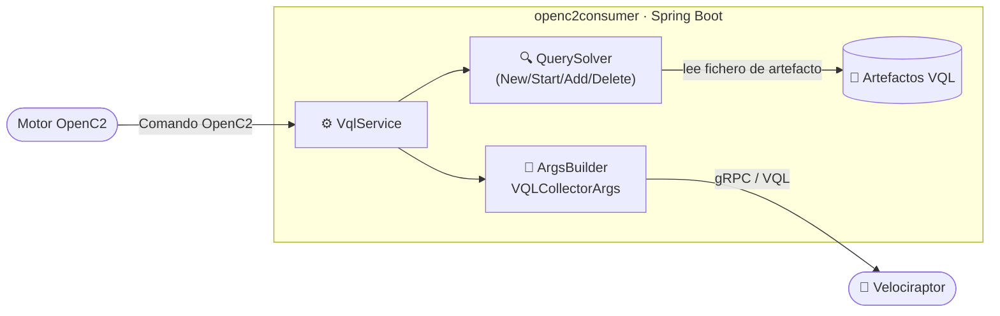
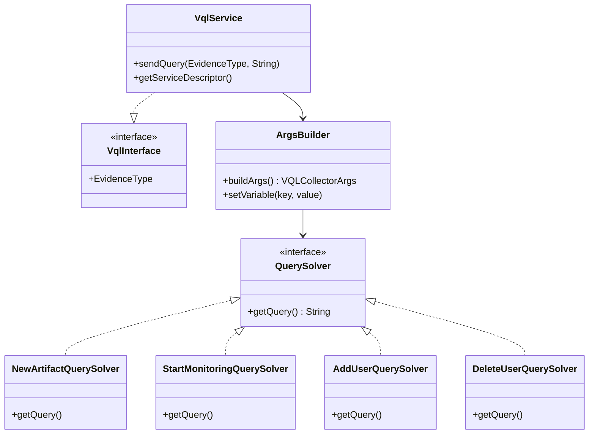

# 🛡️ OpenC2 Consumer

> Agente SOAR que recibe comandos **OpenC2** desde el motor de procesos y los traduce en consultas **VQL** ejecutadas sobre el servidor [Velociraptor](https://docs.velociraptor.app/) configurado.


---

## Contexto

Este componente forma parte del proyecto [SOAR4FUEBA](https://github.com/tfg-projects-dit-us/SOAR4FUEBA), una solución para la Orquestación, Automatización y Respuesta de seguridad (SOAR) que utiliza los estándares del OMG (BPMN y DMN) para la orquestación y automatización de procesos de seguridad en una organización.

Está desarrollada en el marco del proyecto de investigación PID2024-155581OB-C21 – Forensic UEBA: Detección temprana de ciberataques con custodia forense de evidencias digitales en entornos corporativos (FUEBA+)

---

## 🔌 Cliente Velociraptor

El stub gRPC se ha generado a partir del fichero `api.proto` de Velociraptor mediante `mvn clean compile`. Las clases generadas se crean en `target/generated-sources/protobuf/`:

- **`Api.java`** — mensajes Protobuf (`VQLCollectorArgs`, `VQLResponse`…)
- **`VqlApiGrpc.java`** — stub cliente (`VqlApiBlockingStub`, `VqlApiStub`)

Para los tests se usa un servidor **gRPC in-process mock** (`InProcessServerBuilder`), por lo que no se requiere un Velociraptor real en el entorno de desarrollo (pruebas unidad).

---

## 🗺️ Flujo de la aplicación



---

## 📋 Operaciones por evidencia

Los tipos de evidencia disponibles se declaran en el enum `EvidenceType` de `VqlInterface`. Para cada tipo se ofrecen **cuatro operaciones** y **un único fichero de configuración** que es el artefacto.
El nombre de fichero sigue la convención `evidencetype.artifact`.
El nombre del artefacto `UEBA.SOAR.evidencetype`.

Las consultas VQL generadas usan como nombre de artefacto `UEBA.SOAR.evidencetype` y como nombre de tabla `Service.evidencetype`.

| # | Operación | Descripción |
|---|-----------|-------------|
| 1 | 📦 Cargar artefacto | Registra el artefacto `UEBA.SOAR.evidencetype` en Velociraptor |
| 2 | ▶️ Iniciar monitorización | Lanza la recolección sobre la tabla `Service.evidencetype` |
| 3 | ➕ Añadir usuario | Añade un usuario a la monitorización activa |
| 4 | ➖ Eliminar usuario | Elimina un usuario de la monitorización activa |

---

## 🏗️ Arquitectura de la solución

### Diagrama de componentes



### Estructura de ficheros

```
src/
├── main/
│   ├── java/us/dit/ueba/openc2consumer/
│   │   ├── Openc2consumerApplication.java        # Punto de entrada Spring Boot
│   │   ├── config/
│   │   │   └── VelociraptorConfig.java           # Beans gRPC: ManagedChannel, stubs síncrono y asíncrono
│   │   └── services/
│   │       ├── VqlInterface.java                 # Interfaz principal con el enum EvidenceType
│   │       ├── VqlService.java                   # Servicio Spring que envía consultas VQL a Velociraptor vía gRPC
│   │   ├── ArgsBuilder.java                  # Construye VQLCollectorArgs usando la convención UEBA.SOAR.evidencetype
│   │   ├── QuerySolver.java                  # Interfaz que define getQuery(): cada implementación devuelve la VQL adecuada
│   │   ├── StartMonitoringQuerySolver.java   # QuerySolver para iniciar monitorización (tabla Service.evidencetype)
│   │   ├── NewArtifactQuerySolver.java       # QuerySolver para registrar el artefacto UEBA.SOAR.evidencetype
│   │       ├── AddUserQuerySolver.java           # QuerySolver para añadir un usuario a la monitorización
│   │       └── DeleteUserQuerySolver.java        # QuerySolver para eliminar un usuario de la monitorización
│   ├── proto/
│   │   └── api.proto                             # Definición Protobuf del API gRPC de Velociraptor
│   └── resources/
│       ├── application.properties                # Configuración: dirección del servidor y ruta de artefactos
│       └── UEBA.SOAR.logon                       # Fichero de artefacto de ejemplo (tipo de evidencia: logon)
├── test/
│   ├── java/us/dit/ueba/openc2consumer/
│   │   ├── config/
│   │   │   └── TestVelociraptorConfig.java       # Configuración de test: servidor gRPC in-process mock
│   │   └── Openc2consumerApplicationTests.java   # Tests de integración Spring Boot
│   └── resources/
│       └── application.properties                # Propiedades para tests: perfil test, ruta artefactos, log level
└── target/generated-sources/protobuf/            # Clases Java generadas por el compilador protobuf
    └── us/dit/ueba/openc2consumer/proto/
        ├── Api.java                              # Mensajes Protobuf (VQLCollectorArgs, VQLResponse…)
        └── VqlApiGrpc.java                       # Stubs gRPC generados (blocking, async, future)
```